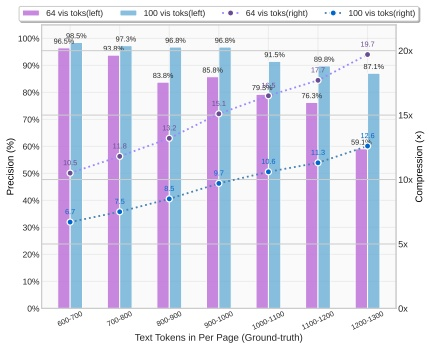
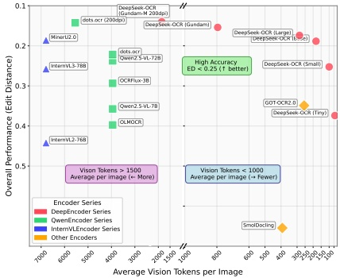

# DeepSeek-OCR: Contexts Optical Compression

Haoran Wei, Yaofeng Sun, Yukun Li

DeepSeek-AI

## Abstract

We present DeepSeek-OCR as an initial investigation into the feasibility of compressing long contexts via optical 2D mapping. DeepSeek-OCR consists of two components: DeepEncoder and DeepSeek3B-MoE-A570M as the decoder. Specifically, DeepEncoder serves as the core engine, designed to maintain low activations under high-resolution input while achieving high compression ratios to ensure an optimal and manageable number of vision tokens. Experiments show that when the number of text tokens is within 10 times that of vision tokens (i.e., a compression ratio  $ < 10\times $), the model can achieve decoding (OCR) precision of 97%. Even at a compression ratio of  $ 20\times $, the OCR accuracy still remains at about 60%. This shows considerable promise for research areas such as historical long-context compression and memory forgetting mechanisms in LLMs. Beyond this, DeepSeek-OCR also demonstrates high practical value. On OmniDocBench, it surpasses GOT-OCR2.0 (256 tokens/page) using only 100 vision tokens, and outperforms MinerU2.0 (6000+ tokens per page on average) while utilizing fewer than 800 vision tokens. In production, DeepSeek-OCR can generate training data for LLMs/VLMs at a scale of 200k+ pages per day (a single A100-40G). Codes and model weights are publicly accessible at http://github.com/deepseek-ai/DeepSeek-OCR.

(a) Compression on Fox benchmark

(b) Performance on Omnidocbench

Figure 1 | Figure (a) shows the compression ratio (number of text tokens in ground truth/number of vision tokens model used) testing on Fox [21] benchmark; Figure (b) shows performance comparisons on OmniDocBench [27]. DeepSeek-OCR can achieve state-of-the-art performance among end-to-end models enjoying the fewest vision tokens.

