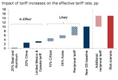
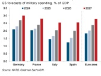
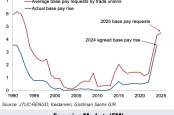
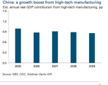
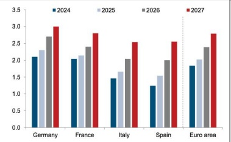
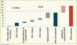
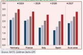
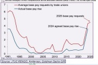
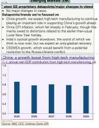
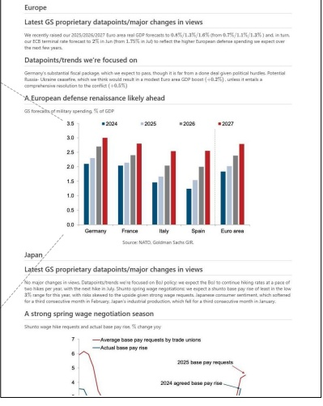

# Macro news and views

## We provide a brief snapshot on the most important economies for the global markets

Latest GS proprietary datapoints/major changes in views

• We now assume a 10pp increase in the US effective tariff rate (vs. 4-5pp prior as reciprocal tariffs and further increases in product-specific tariffs now seem likely.

We raised our Dec 2025 core PCE inflation forecast to ~3.5% (from 2.5%, yoy), lowered our 2025 GDP growth forecast to 1.7% (from 2.4%, Q4/Q4)—our first below-consensus call in 2.5 years—and slightly raised our end-2025 unemployment rate forecast to 4.2% (from 4.1%) and our 12m recession odds to 20% (from 15%) to reflect our new tariff base case.

• Fed cuts: we still expect two in 2025 and one more in 2026.

Source: Elotivano Soto's EIR

Europe

• We recently raised our 2025/2026/2027 Euro area real GDP forecasts to 0.8%/1.3%/1.6% (from 0.7%/1.1%/1.3%) and, in turn, our ECB terminal rate forecast to 2% in Jun (from 1.75% in Jul) to reflect the higher European defense

Germany's substantial fiscal package, which we expect to pass, though it is far from a done deal given political hurdles.

Potential Russia-Ukraine ceasefire, which we think would result in a modest Euro area GDP boost (+0.2%), unless it entails a comprehensive resolution to the conflict (+0.5%).

## Datapoints/trends we're focused on

Goldman Sachs Global Investment Research

• No major changes in views.

Datapoints/trends we're focused on

• Bou policy; we expect the Bou to continue hiking rates at a piece of two hikes per year, with the next hike in July.

• Shunto spring wage negotiations; we expect a shunto base pay rise of at least 3% range for this year, with risks skewed to the upside given strong wage requests.

• Japanese consumer sentiment, which softened for a third consecutive month in February.

• Japan's industrial production, which fell for a third

A strong spring wage negotiation season

Emerging Markets (EM)

China growth; we expect high-tech manufacturing to continue playing an important role in supporting China's growth ahead. China CPI inflation, which fell sharply in February, though this mainly owed to distortions related to the earlier-then-usual Lunar New Year holiday.

India's cyclical growth slowdown, the worst of which we think is now over, but we expect an only-gradual recovery.

CEEMEA growth, which would benefit from a potential resolution to the Russia-Ukraine conflict.

Input image

<image>\nParse the figure.

<table border=1 style='margin: auto; word-wrap: break-word;'><tr><td style='text-align: center; word-wrap: break-word;'></td><td style='text-align: center; word-wrap: break-word;'>2024</td><td style='text-align: center; word-wrap: break-word;'>2025</td><td style='text-align: center; word-wrap: break-word;'>2026</td><td style='text-align: center; word-wrap: break-word;'>2027</td></tr><tr><td style='text-align: center; word-wrap: break-word;'>Germany</td><td style='text-align: center; word-wrap: break-word;'>2.1</td><td style='text-align: center; word-wrap: break-word;'>2.3</td><td style='text-align: center; word-wrap: break-word;'>2.7</td><td style='text-align: center; word-wrap: break-word;'>3.0</td></tr><tr><td style='text-align: center; word-wrap: break-word;'>France</td><td style='text-align: center; word-wrap: break-word;'>2.05</td><td style='text-align: center; word-wrap: break-word;'>2.15</td><td style='text-align: center; word-wrap: break-word;'>2.4</td><td style='text-align: center; word-wrap: break-word;'>2.8</td></tr><tr><td style='text-align: center; word-wrap: break-word;'>Italy</td><td style='text-align: center; word-wrap: break-word;'>1.45</td><td style='text-align: center; word-wrap: break-word;'>1.65</td><td style='text-align: center; word-wrap: break-word;'>2.05</td><td style='text-align: center; word-wrap: break-word;'>2.55</td></tr><tr><td style='text-align: center; word-wrap: break-word;'>Spain</td><td style='text-align: center; word-wrap: break-word;'>1.25</td><td style='text-align: center; word-wrap: break-word;'>1.55</td><td style='text-align: center; word-wrap: break-word;'>2.0</td><td style='text-align: center; word-wrap: break-word;'>2.55</td></tr><tr><td style='text-align: center; word-wrap: break-word;'>Euro area</td><td style='text-align: center; word-wrap: break-word;'>1.85</td><td style='text-align: center; word-wrap: break-word;'>2.05</td><td style='text-align: center; word-wrap: break-word;'>2.4</td><td style='text-align: center; word-wrap: break-word;'>2.8</td></tr></table>

# <image>\n<|grounding|>Convert the document to markdown.

Deep Parsing

Source: Godman Sacks Gm

Gutman Sachs Edtical Investment Research

Result

Rendering

Figure 7 | In the field of financial research reports, the deep parsing mode of DeepSeek-OCR can be used to obtain structured results of charts within documents. Charts are a crucial form of data representation in finance and scientific fields, and the chart structured extraction is an indispensable capability for future OCR models.

