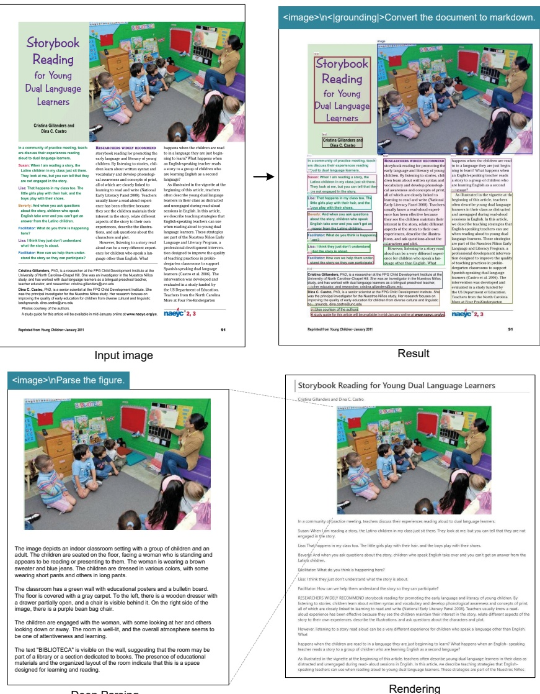

Figure 8 | For books and articles, the deep parsing mode can output dense captions for natural images in the documents. With just a prompt, the model can automatically identify what type of image it is and output the required results.

