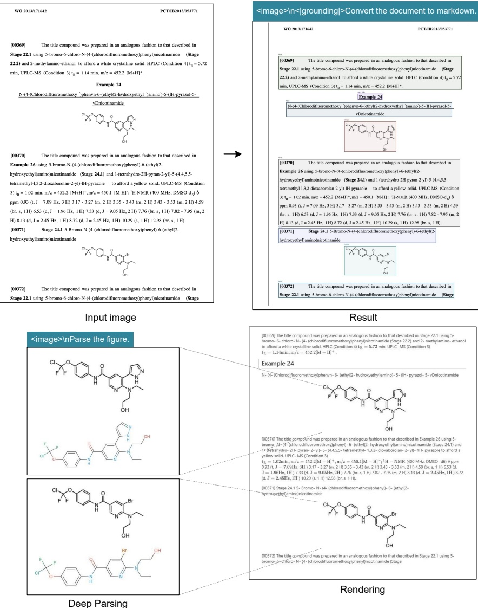

Figure 9 | DeepSeek-OCR in deep parsing mode can also recognize chemical formulas within chemical documents and convert them to SMILES format. In the future, OCR 1.0+2.0 technology may play a significant role in the development of VLM/LLM in STEM fields.

