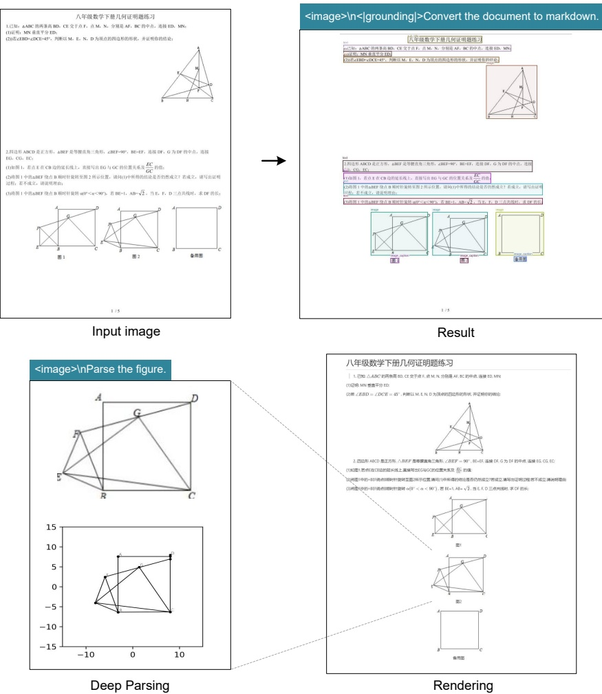

Figure 10 | DeepSeek-OCR also possesses the capability to copy (structure) simple planar geometric figures. Due to the intricate interdependencies among line segments in geometric shapes, parsing geometry task is extremely challenging and has a long way to go.

##### 4.3.2. Multilingual recognition

PDF data on the Internet contains not only Chinese and English, but also a large amount of multilingual data, which is also crucial when training LLMs. For PDF documents, DeepSeek-OCR can handle nearly 100 languages. Like Chinese and English documents, multilingual data also supports both layout and non-layout OCR formats. The visualization results are shown in Figure 11, where we select Arabic and Sinhala languages to demonstrate results.