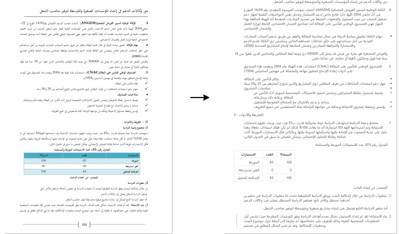

## <image>\n<|grounding|>Convert the document to markdown

Figure 11 | To endow the capability of processing widely crawled PDFs (multilingual data), we train our model with OCR capabilities for nearly 100 languages. Minority language documents can also support both layout and non-layout outputs through different prompts.

##### 4.3.3. General vision understanding

We also provide DeepSeek-OCR with a certain degree of general image understanding capabilities. The related visualization results are shown in Figure 12.