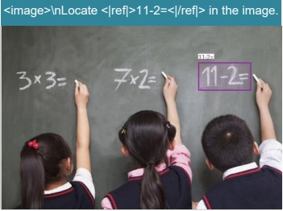
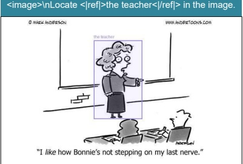
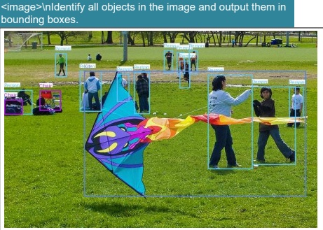

照片，展示了一辆红色的消防栓。消防栓上有一个笑脸，显得非常友好和亲切。消防栓的顶部有一个黑色的盖子，周围有一些金属铆钉。在消防栓的底部，有一个粉红色的贴纸，上面写着“bowtie”。背景中可以看到一条街道，街道上有几辆停放的汽车和一些树木。整体画面给人一种温馨和友好的感觉。

Figure 12 | We retain DeepSeek-OCR's capabilities in general visual understanding, mainly including image description, object detection, grounding, etc. Meanwhile, due to the inclusion of text-only data, DeepSeek-OCR's language capabilities are also retained. Note that since we do not include SFT (Supervised Fine-Tuning) stage, the model is not a chatbot, and some capabilities need completion prompts to be activated.

### 5. Discussion

Our work represents an initial exploration into the boundaries of vision-text compression, investigating how many vision tokens are required to decode N text tokens. The preliminary results are encouraging: DeepSeek-OCR achieves near-lossless OCR compression at approximately  $ 10\times $ ratios, while  $ 20\times $ compression still retains 60% accuracy. These findings suggest promising directions for future applications, such as implementing optical processing for dialogue histories beyond k rounds in multi-turn conversations to achieve  $ 10\times $ compression efficiency.