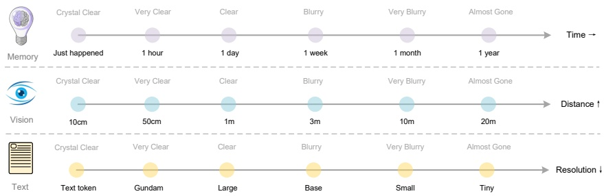

Figure 13 | Forgetting mechanisms constitute one of the most fundamental characteristics of human memory. The contexts optical compression approach can simulate this mechanism by rendering previous rounds of historical text onto images for initial compression, then progressively resizing older images to achieve multi-level compression, where token counts gradually decrease and text becomes increasingly blurred, thereby accomplishing textual forgetting.

For older contexts, we could progressively downsizing the rendered images to further reduce token consumption. This assumption draws inspiration from the natural parallel between human memory decay over time and visual perception degradation over spatial distance—both exhibit similar patterns of progressive information loss, as shown in Figure 13. By combining these mechanisms, contexts optical compression method enables a form of memory decay that mirrors biological forgetting curves, where recent information maintains high fidelity while distant memories naturally fade through increased compression ratios.

While our initial exploration shows potential for scalable ultra-long context processing, where recent contexts preserve high resolution and older contexts consume fewer resources, we acknowledge this is early-stage work that requires further investigation. The approach suggests a path toward theoretically unlimited context architectures that balance information retention with computational constraints, though the practical implications and limitations of such vision-text compression systems warrant deeper study in future research.

### 6. Conclusion

In this technical report, we propose DeepSeek-OCR and preliminarily validate the feasibility of contexts optical compression through this model, demonstrating that the model can effectively decode text tokens exceeding 10 times the quantity from a small number of vision tokens. We believe this finding will facilitate the development of VLMs and LLMs in the future. Additionally, DeepSeek-OCR is a highly practical model capable of large-scale pretraining data production, serving as an indispensable assistant for LLMs. Of course, OCR alone is insufficient to fully validate true context optical compression and we will conduct digital-optical text interleaved pretraining, needle-in-a-haystack testing, and other evaluations in the future. From another perspective, optical contexts compression still offers substantial room for research and improvement, representing a promising new direction.