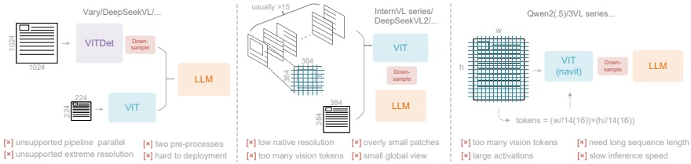

Figure 2 | Typical vision encoders in popular VLMs. Here are three types of encoders commonly used in current open-source VLMs, all of which suffer from their respective deficiencies.

### 2. Related Works

#### 2.1. Typical Vision Encoders in VLMs

Current open-source VLMs employ three main types of vision encoders, as illustrated in Figure 2. The first type is a dual-tower architecture represented by Vary [36], which utilizes parallel SAM [17] encoder to increase visual vocabulary parameters for high-resolution image processing. While offering controllable parameters and activation memory, this approach suffers from significant drawbacks: it requires dual image preprocessing that complicates deployment and makes encoder pipeline parallelism challenging during training. The second type is tile-based method exemplified by InternVL2.0 [8], which processes images by dividing them into small tiles for parallel computation, reducing activation memory under high-resolution settings. Although capable of handling extremely high resolutions, this approach has notable limitations due to its typically low native encoder resolution (below 512×512), causing large images to be excessively fragmented and resulting in numerous vision tokens. The third type is adaptive resolution encoding represented by Qwen2-VL [35], which adopts the NaViT [10] paradigm to directly process full images through patch-based segmentation without tile parallelization. While this encoder can handle diverse resolutions flexibly, it faces substantial challenges with large images due to massive activation memory consumption that can cause GPU memory overflow, and sequence packing requires extremely long sequence lengths during training. Long vision tokens will slow down both prefill and generation phases of inference.

#### 2.2. End-to-end OCR Models

OCR, particularly document parsing task, has been a highly active topic in the image-to-text domain. With the advancement of VLMs, a large number of end-to-end OCR models have emerged, fundamentally transforming the traditional pipeline architecture (which required separate detection and recognition expert models) by simplifying OCR systems. Nougat [6] first employs end-to-end framework for academic paper OCR on arXiv, demonstrating the potential of models in handling dense perception tasks. GOT-OCR2.0 [38] expands the scope of OCR2.0 to include more synthetic image parsing tasks and designs an OCR model with performance-efficiency trade-offs, further highlighting the potential of end-to-end OCR researches. Additionally, general vision models such as Qwen-VL series [35], InternVL series [8], and many their derivatives continuously enhance their document OCR capabilities to explore dense visual perception boundaries. However, a crucial research question that current models have not addressed is: for a document containing 1000 words, how many vision tokens are at least needed for decoding? This question holds significant importance for research in the principle that "a picture is worth a thousand words."