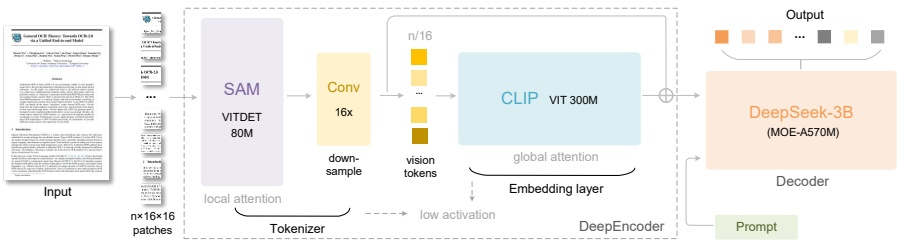

Figure 3 | The architecture of DeepSeek-OCR. DeepSeek-OCR consists of a DeepEncoder and a DeepSeek-3B-MoE decoder. DeepEncoder is the core of DeepSeek-OCR, comprising three components: a SAM [17] for perception dominated by window attention, a CLIP [29] for knowledge with dense global attention, and a 16x token compressor that bridges between them.

### 3. Methodology

#### 3.1. Architecture

As shown in Figure 3, DeepSeek-OCR enjoys a unified end-to-end VLM architecture consisting of an encoder and a decoder. The encoder (namely DeepEncoder) is responsible for extracting image features and tokenizing as well as compressing visual representations. The decoder is used for generating the required result based on image tokens and prompts. DeepEncoder is approximately 380M in parameters, mainly composed of an 80M SAM-base [17] and a 300M CLIP-large [29] connected in series. The decoder adopts a 3B MoE [19, 20] architecture with 570M activated parameters. In the following paragraphs, we will delve into the model components, data engineering, and training skills.

#### 3.2. DeepEncoder

To explore the feasibility of contexts optical compression, we need a vision encoder with the following features: 1. Capable of processing high resolutions; 2. Low activation at high resolutions; 3. Few vision tokens; 4. Support for multiple resolution inputs; 5. Moderate parameter count. However, as described in the Section 2.1, current open-source encoders cannot fully satisfy all these conditions. Therefore, we design a novel vision encoder ourselves, named DeepEncoder.

##### 3.2.1. Architecture of DeepEncoder

DeepEncoder mainly consists of two components: a visual perception feature extraction component dominated by window attention, and a visual knowledge feature extraction component with dense global attention. To benefit from the pretraining gains of previous works, we use SAM-base (patch-size 16) and CLIP-large as the main architectures for the two components respectively. For CLIP, we remove the first patch embedding layer since its input is no longer images but output tokens from the previous pipeline. Between the two components, we borrow from Vary [36] and use a 2-layer convolutional module to perform 16× downsampling of vision tokens. Each convolutional layer has a kernel size of 3, stride of 2, padding of 1, and channels increase from 256 to 1024. Assuming we input a 1024×1024 image, the DeepEncoder will segment it into 1024/16×1024/16=4096 patch tokens. Since the first half of encoder is dominated by window attention and only 80M, the activation is acceptable. Before entering global attention,