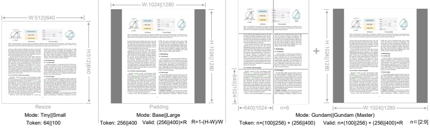

Figure 4 | To test model performance under different compression ratios (requiring different numbers of vision tokens) and enhance the practicality of DeepSeek-OCR, we configure it with multiple resolution modes.

the 4096 tokens go through the compression module and the token count becomes 4096/16=256, thus making the overall activation memory controllable.

Table 1 | Multi resolution support of DeepEncoder. For both research and application purposes, we design DeepEncoder with diverse native resolution and dynamic resolution modes.

<table border=1 style='margin: auto; word-wrap: break-word;'><tr><td rowspan="2">Mode</td><td colspan="4">Native Resolution</td><td colspan="2">Dynamic Resolution</td></tr><tr><td style='text-align: center; word-wrap: break-word;'>Tiny</td><td style='text-align: center; word-wrap: break-word;'>Small</td><td style='text-align: center; word-wrap: break-word;'>Base</td><td style='text-align: center; word-wrap: break-word;'>Large</td><td style='text-align: center; word-wrap: break-word;'>Gundam</td><td style='text-align: center; word-wrap: break-word;'>Gundam-M</td></tr><tr><td style='text-align: center; word-wrap: break-word;'>Resolution</td><td style='text-align: center; word-wrap: break-word;'>512</td><td style='text-align: center; word-wrap: break-word;'>640</td><td style='text-align: center; word-wrap: break-word;'>1024</td><td style='text-align: center; word-wrap: break-word;'>1280</td><td style='text-align: center; word-wrap: break-word;'>640+1024</td><td style='text-align: center; word-wrap: break-word;'>1024+1280</td></tr><tr><td style='text-align: center; word-wrap: break-word;'>Tokens</td><td style='text-align: center; word-wrap: break-word;'>64</td><td style='text-align: center; word-wrap: break-word;'>100</td><td style='text-align: center; word-wrap: break-word;'>256</td><td style='text-align: center; word-wrap: break-word;'>400</td><td style='text-align: center; word-wrap: break-word;'>n $ \times $100+256</td><td style='text-align: center; word-wrap: break-word;'>n $ \times $256+400</td></tr><tr><td style='text-align: center; word-wrap: break-word;'>Process</td><td style='text-align: center; word-wrap: break-word;'>resize</td><td style='text-align: center; word-wrap: break-word;'>resize</td><td style='text-align: center; word-wrap: break-word;'>padding</td><td style='text-align: center; word-wrap: break-word;'>padding</td><td style='text-align: center; word-wrap: break-word;'>resize + padding</td><td style='text-align: center; word-wrap: break-word;'>resize + padding</td></tr></table>

##### 3.2.2. Multiple resolution support

Suppose we have an image with 1000 optical characters and we want to test how many vision tokens are needed for decoding. This requires the model to support a variable number of vision tokens. That is to say the DeepEncoder needs to support multiple resolutions.

We meet the requirement aforementioned through dynamic interpolation of positional encodings, and design several resolution modes for simultaneous model training to achieve the capability of a single DeepSeek-OCR model supporting multiple resolutions. As shown in Figure 4, DeepEncoder mainly supports two major input modes: native resolution and dynamic resolution. Each of them contains multiple sub-modes.

Native resolution supports four sub-modes: Tiny, Small, Base, and Large, with corresponding resolutions and token counts of 512×512 (64), 640×640 (100), 1024×1024 (256), and 1280×1280 (400) respectively. Since Tiny and Small modes have relatively small resolutions, to avoid wasting vision tokens, images are processed by directly resizing the original shape. For Base and Large modes, in order to preserve the original image aspect ratio, images are padded to the corresponding size. After padding, the number of valid vision tokens is less than the actual number of vision tokens, with the calculation formula being:

 $$ N_{v a l i d}=\lceil N_{a c t u a l}\times[1-((m a x(w,h)-m i n(w,h))/(m a x(w,h)))]\rceil $$ 

where w and h represent the width and height of the original input image.