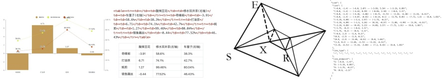

(a) Image-text ground truth of chart

(b) Image-text ground truth of geometry

Figure 6 | For charts, we do not use OneChart's [7] dictionary format, but instead use HTML table format as labels, which can save a certain amount of tokens. For plane geometry, we convert the ground truth to dictionary format, where the dictionary contains keys such as line segments, endpoint coordinates, line segment types, etc., for better readability. Each line segment is encoded using the Slow Perception [39] manner.

to render 10M images, mainly including commonly used line, bar, pie, and composite charts. We define chart parsing as image-to-HTML-table conversion task, as shown in Figure 6(a). For chemical formulas, we utilize SMILES format from PubChem as the data source and render them into images using RDKit, constructing 5M image-text pairs. For plane geometry images, we follow Slow Perception [39] for generation. Specifically, we use perception-ruler size as 4 to model each line segment. To increase the diversity of rendered data, we introduce geometric translation-invariant data augmentation, where the same geometric image is translated in the original image, corresponding to the same ground truth drawn at the centered position in the coordinate system. Based on this, we construct a total of 1M plane geometry parsing data, as illustrated in Figure 6(b).

##### 3.4.3. General vision data

DeepEncoder can benefit from CLIP’s pretraining gains and has sufficient parameters to incorporate general visual knowledge. Therefore, we also prepare some corresponding data for DeepSeek-OCR. Following DeepSeek-VL2 [40], we generate relevant data for tasks such as caption, detection, and grounding. Note that DeepSeek-OCR is not a general VLM model, and this portion of data accounts for only 20% of the total data. We introduce such type of data mainly to preserve the general vision interface, so that researchers interested in our model and general vision task can conveniently advance their work in the future.

##### 3.4.4. Text-only data

To ensure the model’s language capabilities, we introduced 10% of in-house text-only pretrain data, with all data processed to a length of 8192 tokens, which is also the sequence length for DeepSeek-OCR. In summary, when training DeepSeek-OCR, OCR data accounts for 70%, general vision data accounts for 20%, and text-only data accounts for 10%.

#### 3.5. Training Pipelines

Our training pipeline is very simple and consists mainly of two stages: a). Training DeepEncoder independently; b). Training the DeepSeek-OCR. Note that the Gundam-master mode is obtained by continuing training on a pre-trained DeepSeek-OCR model with 6M sampled data. Since the training protocol is identical to other modes, we omit the detailed description hereafter.