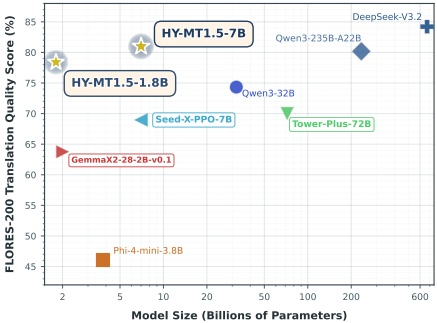
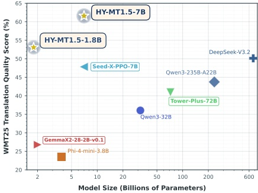

(a) Model size versus Flores-200 (XX ⇔ XX) translation quality for different-scale open-source models.

(b) Model size versus WMT25 translation quality for different-scale open-source models.

Figure 2: Comparison of model size versus translation quality across Flores-200 and WMT25 datasets for open-source models.

## 1 Introduction

Machine translation (MT) has long been a high-demand practical goal and a prominent research challenge pursued by the computational linguistics community over the past few decades (Brown et al., 1990; 1993; Papineni et al., 2002; Sutskever et al., 2014; Bahdanau et al., 2015; Wu et al., 2016; Vaswani et al., 2017). The rapid advancement of large language models (LLMs) has revolutionized the learning paradigm of machine translation, shifting from traditional rule-based and statistical approaches to large-scale neural learning methodologies, and continuously pushing the boundaries of translation quality to unprecedented levels (Zhu et al., 2024; Kocmi et al., 2024; Pang et al., 2025). State-of-the-art closed-source models, such as Gemini-3.0-Pro (DeepMind, 2025), have demonstrated capabilities that approach or surpass those of expert human translators in specific language pairs.

Nevertheless, significant challenges persist in machine translation (Kocmi et al., 2025). First and foremost, the balance between translation quality and efficiency remains a critical unaddressed issue. State-of-the-art large-scale closed-source models often deliver high translation quality but incur prohibitive deployment costs and low inference efficiency due to their enormous parameter sizes, making them inaccessible for widespread practical applications (e.g., edge device deployment and high-throughput translation scenarios). Meanwhile, existing lightweight open-source models typically sacrifice translation quality to achieve efficiency, failing to match the performance of large closed-source models, thereby exacerbating the disparity between practical availability and the demands for high-quality translation. Second, current translation systems are predominantly limited to basic text translation tasks and lack support for customized translation requirements through flexible interaction with prompts. For instance, key capabilities such as contextual translation (maintaining coherence across multi-turn or long-document translation) and formatted translation (preserving the original document structure, such as tables, lists, and formulas) are insufficiently addressed. These limitations hinder the adaptation of translation systems to diverse real-world scenarios, in which customized requirements are increasingly prevalent.

These two core challenges—quality-efficiency imbalance and inadequate customized translation support—severely restrict the further advancement and widespread adoption of machine translation technology, highlighting the urgent need for innovative solutions that can simultaneously address efficiency, quality, and customization demands.

To directly tackle the aforementioned two core challenges, we present the HY-MT1.5 models and corresponding technical solutions, with three key contributions that closely align with the pain points:

1. High-performance and efficient HY-MT1.5 models: Targeting the core challenge of balancing translation quality and efficiency, we propose HY-MT1.5-1.8B and HY-MT1.5-7B that achieve a superior performance-efficiency balance. As shown in Figure 4 and 2, the 1.8B-parameter HY-MT1.5-1.8B comprehensively outperforms mainstream medium-sized open-source models (e.g., Tower-Plus-72B Rei et al., 2025, Qwen3-32B (Team, 2025)) and commercial translation APIs, reaching the 90th percentile of ultra-large closed-source models like Gemini-3.0-Pro (DeepMind, 2025). The 7B-parameter HY-MT1.5-7B further reaches the 95th percentile of Gemini-3.0-Pro (DeepMind, 2025) on the Flores-200 dataset (Team et al., 2022) and even surpasses it on WMT25 (Kocmi et al., 2025) and Mandarin-minority