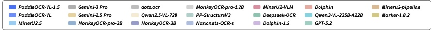
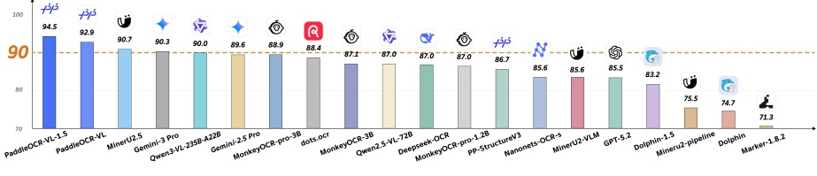
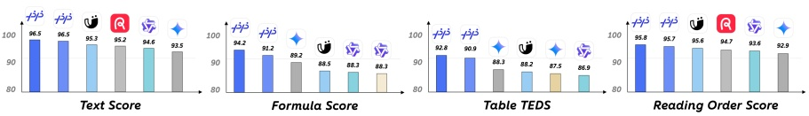
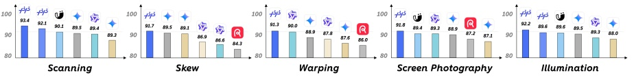

# PaddleOCR-VL-1.5: Towards a Multi-Task 0.9B VLM for Robust In-the-Wild Document Parsing

Cheng Cui, Ting Sun, Suyin Liang, Tingquan Gao, Zelun Zhang, Jiaxuan Liu, Xueqing Wang, Changda Zhou, Hongen Liu, Manhui Lin, Yue Zhang, Yubo Zhang, Yi Liu, Dianhai Yu, Yanjun Ma

PaddlePaddle Team, Baidu Inc.

paddleocr@baidu.com

Official Website: https://www.paddleocr.com

Source Code: https://github.com/PaddlePaddle/PaddleOCR

Models: https://huggingface.co/PaddlePaddle

## Abstract

We introduce PaddleOCR-VL-1.5, an upgraded model achieving a new state-of-the-art (SOTA) accuracy of 94.5% on OmniDocBench v1.5. To rigorously evaluate robustness against real-world physical distortions—including scanning, skew, warping, screen-photography, and illumination—we propose the Real5-OmniDocBench benchmark. Experimental results demonstrate that this enhanced model attains SOTA performance on the newly curated benchmark. Furthermore, we extend the model's capabilities by incorporating seal recognition and text spotting tasks, while remaining a 0.9B ultra-compact VLM with high efficiency.

Figure 1 | Performance of PaddleOCR-VL-1.5 on OmniDocBench v1.5 and Real5-OmniDocBench.

