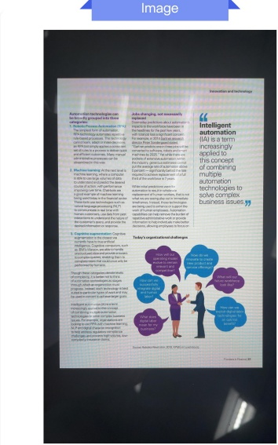
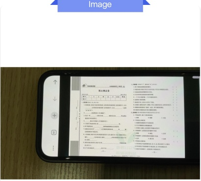

### PaddleOCR-VL-1.5

## Automation technologies can be broadly grouped into three categories:

1. Robotic Process Automation (RPA): The simplest form of automation, RPA technology automates repetitive rule-based processes. This technology cannot learn, adapt or make decisions; an RPA bot simply applies a consistent set of rules to a process to deliver quick and efficient outcomes. Many manual administrative processes can be streamlined in this way.

2. Machine learning: At the next level is machine learning, where a computer is able to use large volumes of data to understand and predict the desired course of action, with performance improving over time. Chat-bots are a good example of machine learning being used today in the financial sector. These bots use technologies such as natural language processing (NLP) to communicate in real time with human customers, use data from past interactions to understand the nature of the customer's query, and provide the desired information or response.

3. Cognitive augmentation: Cognitive augmentation is the closest we currently have to true artificial intelligence. Cognitive computers, such as IBM's Watson, are able to handle unstructured data and provide answers to complex queries, enabling them to complete tasks that could once only be performed by humans.

Though these categories denote levels of complexity, it is better not to think of automation technologies as stages through which an organization must progress. Instead, each technology is best suited to particular types of work and may be used in concert to achieve larger goals.

Intelligent automation (IA) is a term increasingly applied to this concept of combining multiple automation technologies to solve complex business issues. For example, organizations are looking to use RPA with machine learning, NLP and digital character recognition to help address regulatory compliance challenges and process high-volume, low-complexity insurance claims.

## Jobs changing, not necessarily replaced

Doomsday predictions about automation's impacts to the workforce have been in the headlines for the past few years, with total job loss a significant concern. For example, in 2014 Gartner research director Peter Sondergaard stated, "Gartner predicts one in three jobs will be converted to software, robots and smart machines by 2025." Yet while there are pockets of extensive automation within the industry, generous estimates cannot put the average rate of automation above 5 percent — significantly behind the rate required to achieve replacement of a full third of the workforce in 7 years.

While initial predictions were for automation to result in wholesale replacement of human workers, that is not what we are seeing play out in immediate timeframes. Instead, these technologies are being used to enhance or support the work of human employees. Automation capabilities can help remove the burden of repetitive administrative work or provide information to help individuals make better decisions, allowing employees to focus on

## Intelligent automation

(IA) is a term increasingly applied to this concept of combining multiple automation technologies to solve complex business issues.

Today's organizational challenges

### PaddleOCR-VL-1.5

## 夺冠新课堂 三年级科学下·DX 期末测试卷

<table border=1 style='margin: auto; word-wrap: break-word;'><tr><td style='text-align: center; word-wrap: break-word;'>题号</td><td style='text-align: center; word-wrap: break-word;'>一</td><td style='text-align: center; word-wrap: break-word;'>二</td><td style='text-align: center; word-wrap: break-word;'>三</td><td style='text-align: center; word-wrap: break-word;'>四</td><td style='text-align: center; word-wrap: break-word;'>五</td><td style='text-align: center; word-wrap: break-word;'>六</td><td style='text-align: center; word-wrap: break-word;'>总分</td><td style='text-align: center; word-wrap: break-word;'>等级</td></tr><tr><td style='text-align: center; word-wrap: break-word;'>得分</td><td style='text-align: center; word-wrap: break-word;'></td><td style='text-align: center; word-wrap: break-word;'></td><td style='text-align: center; word-wrap: break-word;'></td><td style='text-align: center; word-wrap: break-word;'></td><td style='text-align: center; word-wrap: break-word;'></td><td style='text-align: center; word-wrap: break-word;'></td><td style='text-align: center; word-wrap: break-word;'></td><td style='text-align: center; word-wrap: break-word;'></td></tr></table>

## 一、 填空题(每空1分,共23分)

1. 体积相同，质量不同的两种液体，如果把轻的液体倒入重的液体中，它会___；如果把重的液体倒入轻的液体中，它会___（选填“沉”或“浮”）

3. 电是一种___，太阳发出的___、物体发出的___等也都是能量的不同表现形式。

5. 小狗房子的选材要求：要___、___、___等。

6. 种子能萌发成能帮助植物吸收水分和

7. 植物茎内有许多“”，它们能够把根吸收的___和___输送到植物的叶等器官里。

8. 人们根据土壤中所含沙粒和黏粒量的多少，把土壤分

为三类：含黏粒多的土壤叫含沙粒多的土壤叫沙粒和黏粒的含量差不多的土壤叫

9. 固体有确定的形状, 我们可以用___、___、___等数值来描述它的大小。

10. 空气没有确定的___，但空气有___。

## 二、 判断题(对的画“√”，错的画“×”)(10

1. 种子和根是植物的重要器官。（）

2. 要想知道小狗房子的大小是否合适，可以让小狗钻进去试试。（）

3. 变成油条的面团物质发生变化。（）

5. 一个开关只能控制一个小灯泡的亮和灭。

6. 菜

7. 清洗梨子时，它的大小发生了变化。（）

8. 在观察土壤的活动中，要戴上手套，完成活动之后，还要及时洗手。()

9. 把物体的质量称为“重量”，这是一种不规范的说法。

10. 物体所含物质的多少称为物体的体积。（）

## 三、 选择题（将正确答案的序号填在括号里）（24分）

1 下班选项中，属于天然材料的是（）

A. 绝缘体的绝缘性并不是绝对的

C. 发现有人触电，应直接用手将触电者拉开

3. 下列植物中，会借助水来传播种子的是()

4. 下列植物中，会借助动物来传播种子的是()

5. 下列说法正确的是（）

A. 所有绿色开花植物都有根、茎、叶、花、果实和种子六大器官

B. 所有绿色开花植物都可以通过根、茎、叶等来繁殖后代

C. 绿色开花植物不一定都用种子来繁殖后代

Figure A3 | The Markdown Output for Screen Photography.

