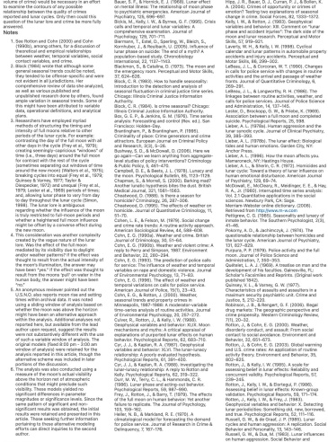
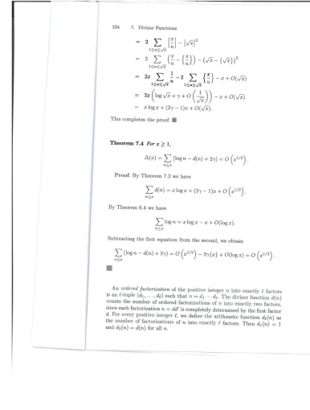

##### J.A. Schapfer et al. / Journal of Criminal Justice 38 (2018) 310–367

## Notes

## Refimmos

## Image

### PaddleOCR-VL-1.5

= 2  $ \sum_{1 \leq k \leq \sqrt{2}} \left[ \frac{x}{u} \right] - \left[ \sqrt{x} \right]^2 $

= 2  $ \sum_{1 \leq k \leq \sqrt{2}} \left[ \frac{x}{u} - \left[ \frac{x}{u} \right] \right] - \left( \sqrt{x} - \left[ \sqrt{x} \right]^2 \right)^2 $

= 2x  $ \sum_{1 \leq k \leq \sqrt{2}} \frac{1}{u} - 2 \sum_{1 \leq k \leq \sqrt{2}} \left[ \frac{x}{u} - x + O(\sqrt{x}) \right] $

= 2x  $ \left( \log \sqrt{x} + \gamma + O \left( \frac{1}{\sqrt{x}} \right) \right) - x + O(\sqrt{x}) $

= z  $ \log x + (2y - 1)x + O(\sqrt{x}) $

This completes the proof.

Theorem 7.4 For x ≥ 1,

 $ \Delta(x) = \sum_{n \leq x} \left( \log n - d(n) + 2\gamma \right) O \left( x^{1/2} \right) $.

Proof. By Theorem 7.3 we have

 $ \sum_{n \leq x} d(n) = x \log x + (2\gamma - 1)x + O \left( x^{1/2} \right) $.

By Theorem 6.4 we have

 $ \sum_{n \leq x} \log n = z \log x - z + O(\log z) $.

Subtracting the first equation from the second, we obtain

 $ \sum_{n \leq x} \left( \log n - d(n) + 2\gamma \right) O \left( x^{1/2} \right) - 2\gamma(z) + O \left( \log z \right) = O \left( x^{1/2} \right) $.

An ordered factorization of the positive integer n into exactly £ factors is an £-tuple  $ (d_1, \ldots, d_k) $ such that = d_1 = d_k. The division function  $ d(n) $ counts the number of ordered factorizations of n into exactly two factors, since each factorization n = dd' is completely determined by the first factor. For every positive integer £, we define the arithmetic function  $ d_n(n) $ as the number of factorizations of n into exactly £ factors. Then  $ d_1(n) = 1 $ and  $ d_2(n) = d(n) $ for all n.

Figure A4 | The Markdown Output for Scanning.

