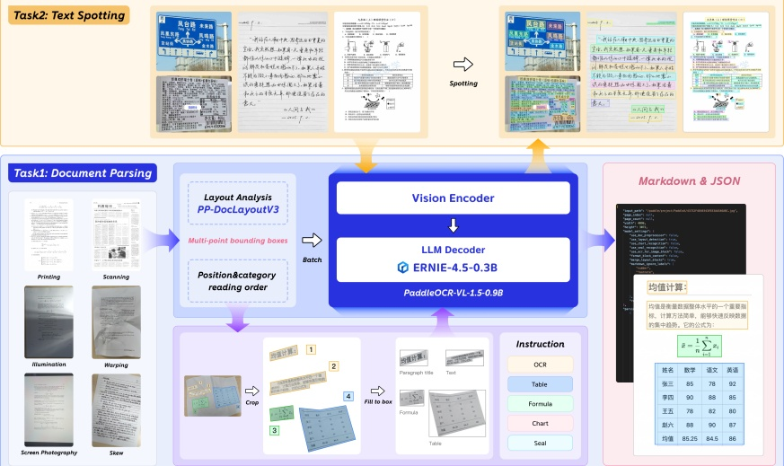

of-the-art (SOTA) standard. On the OmniDocBench v1.5 benchmark, our model achieves a breakthrough accuracy of 94.5%, maintaining its position as the official top-ranked solution. More importantly, on the newly curated Real5-OmniDocBench, the model sets a new record with an overall accuracy of 92.05%. Despite its compact 0.9B scale, it significantly outperforms massive general VLMs, such as Qwen3-VL-235B [6] and Gemini-3 Pro [15], highlighting its exceptional parameter efficiency. Furthermore, our model expands its capabilities to text spotting and seal recognition, attaining leading performance across diverse and challenging benchmarks. These results collectively validate its superior robustness and generalization in complex, real-world scenarios. Appendix A details the specific upgrades and changes in PaddleOCR-VL-1.5 compared to its predecessor.

#### 2. PaddleOCR-VL-1.5

#### 2.1. Architecture

PaddleOCR-VL-1.5 introduces an enhanced framework capable of handling both Document Parsing and Text Spotting, as depicted in Figure 2.

Figure 2 | The overview of PaddleOCR-VL-1.5.

For the Document Parsing task, PaddleOCR-VL-1.5 adopts a robust two-stage framework. In the initial stage, PP-DocLayoutV3 performs sophisticated layout analysis. Beyond standard axis-aligned detection, it is specifically optimized for real-world complexity by employing multi-point localization (e.g., quadrilaterals or polygons). This allows for the precise boundary anchoring of semantic regions even under severe perspective tilt or physical curvature, while simultaneously establishing the logical reading order. In the second stage, the PaddleOCR-VL-1.5-0.9B model takes these geometrically-rectified or localized regions as input to perform