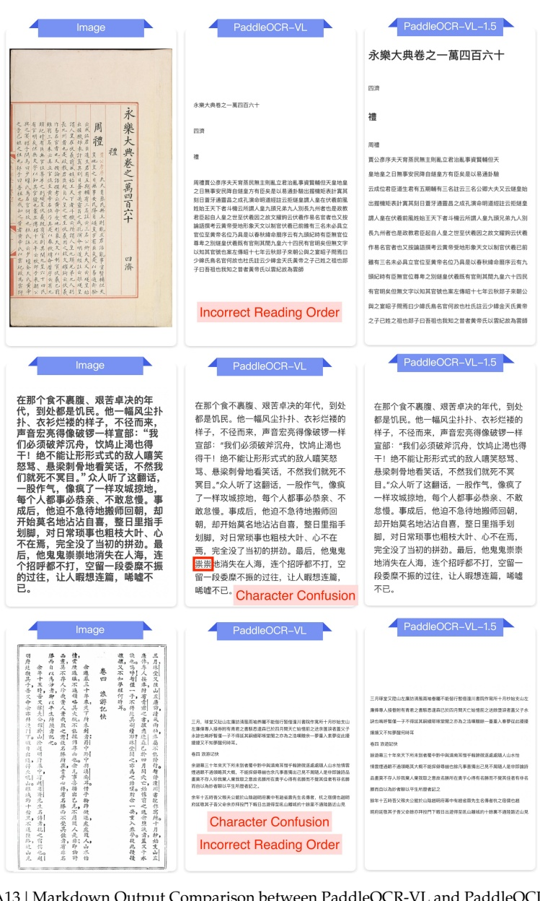

##### E.3.3. Text Recognition for Long-tail Scenarios

在那个食不裹腹、艰苦卓决的年代，到处都是饥民。他一幅风尘扑扑、衣衫烂楼的样子，不径而来，声音宏亮得像破锣一样宣部：“我们必须破斧沉舟，饮鸠止渴也得干！绝不能让形形式式的敌人嘻笑怒骂、悬梁刺骨地看笑话，不然我们就死不冥目。”众人听了这翻话，一股作气，像疯了一样攻城掠地，每个人都事必恭亲、不敢怠慢。事成后，他迫不急待地搬师回朝，却开始莫名地沾沾自喜，整日里指手划脚，对日常琐事也粗枝大叶、心不在焉，完全没了当初的拼劲。最后，他鬼鬼祟祟地消失在人海，连个招呼都不打，空留一段委糜不振的过往，让人暇想连篇，唏嘘不已。

## Image

## PaddleOCR-VL

### PaddleOCR-VL-1.5

在那个食不腹膈、艰苦卓久的年代，到处都是饥民。他一幅风尘扑扑、衣衫褴褛的样子，不径而来，声音宏亮得像破锣一样宣部：“我们必须破斧沉舟，饮鸠止渴也得干！绝不能让形形式式的敌人嘈笑怒骂、悬梁刺骨地看笑话，不然我们就死不买耳。”众人听了这翻话，一股作气，像疯了一样攻城掠地，每个人都事必恭亲、不敢怠慢。事成后，他迫不急待地搬师回朝，却开始莫名地沾沾自喜，整日里指手划脚，对日常琐事也粗枝大叶、心不在焉，完全没了当初的拼劲。最后，他鬼鬼崇崇地消失在人海，连个招呼都不打，空留一段委糜不振的过往，让人暇想连篇，唏嘘不已。

在那个食不腹膈、艰苦卓久的年代，到处都是饥民。他一幅风尘扑扑、衣衫褴褛的样子，不径而来，声音宏亮得像破锣一样宣部：“我们必须破斧沉舟，饮鸠止渴也得干！绝不能让形形式式的敌人嘈笑怒骂、悬梁刺骨地看笑话，不然我们就死不买耳。”众人听了这翻话，一般人作气，像疯了一样攻城掠地，每个人都事必恭亲、不敢怠慢。事成后，他迫不急待地搬师回朝，却开始莫名地沾沾自喜，整日里指手划脚，对日常琐事也粗枝大叶、心不在焉，完全没了当初的拼劲。最后，他鬼鬼崇崇地消失在人海，连个招呼都不打，空留一段委糜不振的过往，让人暇想连篇，唏嘘不已。

Figure A13 | Markdown Output Comparison between PaddleOCR-VL and PaddleOCR-VL-1.5 on Long-tail Scenarios Documents.

