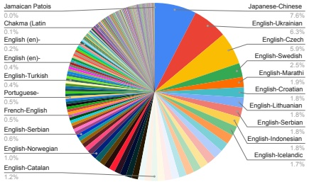
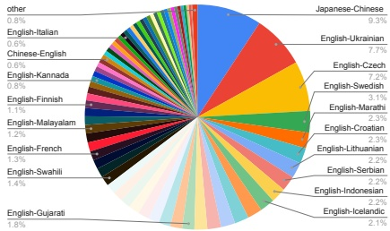

(a) SFT data mixture.

(b) RL data mixture.

Figure 1 | Language distribution in the TranslateGemma data mixtures measured as model tokens.

as reward models, to further boost translation quality.

We used the following metrics as reward models during RL:

• MetricX-24-XXL-QE (Juraska et al., 2024), a learned, regression-based translation metric producing a floating point score between 0 (best) and 25 (worst), matching the standard Multidimensional Quality Metrics (MQM) score range (Freitag et al., 2021). MetricX scores were linearly rescaled, using 5.0 – score, when computing rewards, so that higher scores indicate better quality. Although MetricX can take source, reference, and hypothesis as input, we used it as a QE metric by passing in an empty reference.

• Gemma-AutoMQM-QE, a finetuned AutoMQM model (Fernandes et al., 2023). This model was initialized from the Gemma 3-27B-IT checkpoint (Gemma Team, 2025), and was trained on MQM ratings data from WMT 2020 - WMT 2023 (Freitag et al., 2021; Lommel et al., 2014). Default MQM weights (Freitag et al., 2021) were used in computing (token-level) rewards from AutoMQM outputs. As with MetricX, it ignores the reference translation.

- ChrF (Popović, 2015), a lexical overlap-based translation metric. This was the only reward model for which the (synthetic) references were used. ChrF scores were scaled by a factor of two to be on approximately the same scale as the other rewards.

- Naturalness Autorater developed in-house, using the base RL policy model as a prompted LLM-as-a-Judge. As with AutoMQM, this Autorater elicited span-level annotations. This Autorater was instructed to penalize spans in the machine-translated text which did not sound like they were produced by a native speaker (conditioned on the naturalness errors in the output not stemming from an unnatural source input).

• Generalist reward model covering many tasks, including reasoning, instruction following, and multilingual abilities, adapted from the general Gemma 3 post-training setup (Gemma Team, 2025).

We used RL algorithms extended to support token-level advantages, which were added to the advantages computed from sequence-level rewards. This allowed us to use fine-grained, span-level reward signals from AutoMQM and the Naturalness Autorater directly, for improved credit assignment and training efficiency in the spirit of Ramos et al. (2025). See Figure 2 for an illustration of how MetricX and AutoMQM rewards were (additively) combined during advantage computation. The combined advantages were then batch-normalized.

### 5. Automatic Evaluation

#### 5.1. Text translation

We evaluate TranslateGemma using MetricX 24 (Juraska et al., 2024) and CoMET22 (Rei et al.,