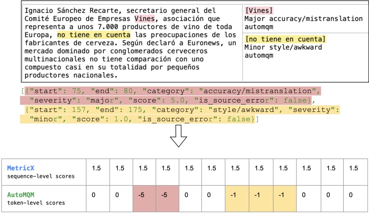

Ignacio Sánchez Recarte, secretario general del Comité Europeo de Empresas Vines, asociación que representa a unos 7.000 productores de vino de toda Europa, no tiene en cuenta las preocupaciones de los fabricantes de cerveza. Según declaró a Euronews, un mercado dominado por conglomerados cerveceros multinacionales no tiene comparación con uno compuesto casi en su totalidad por pequeños productores nacionales.

Figure 2 | Illustration of how sequence-level and token-level rewards are additively combined during advantage computation in RL. Note that advantage is computed from sequence-level rewards as'reward-to-go', meaning that rewards are broadcast uniformly to every token.

Table 1 | Automatic evaluation results using MetricX and CoMET22 (C22) on WMT24++.

<table border=1 style='margin: auto; word-wrap: break-word;'><tr><td style='text-align: center; word-wrap: break-word;'>Size</td><td style='text-align: center; word-wrap: break-word;'>System</td><td style='text-align: center; word-wrap: break-word;'>MetricX $ \downarrow $</td><td style='text-align: center; word-wrap: break-word;'>C22 $ \uparrow $</td></tr><tr><td rowspan="2">27B</td><td style='text-align: center; word-wrap: break-word;'>Gemma 3</td><td style='text-align: center; word-wrap: break-word;'>4.04</td><td style='text-align: center; word-wrap: break-word;'>83.1</td></tr><tr><td style='text-align: center; word-wrap: break-word;'>TranslateGemma</td><td style='text-align: center; word-wrap: break-word;'>3.09</td><td style='text-align: center; word-wrap: break-word;'>84.4</td></tr><tr><td rowspan="2">12B</td><td style='text-align: center; word-wrap: break-word;'>Gemma 3</td><td style='text-align: center; word-wrap: break-word;'>4.86</td><td style='text-align: center; word-wrap: break-word;'>81.6</td></tr><tr><td style='text-align: center; word-wrap: break-word;'>TranslateGemma</td><td style='text-align: center; word-wrap: break-word;'>3.60</td><td style='text-align: center; word-wrap: break-word;'>83.5</td></tr><tr><td rowspan="2">4B</td><td style='text-align: center; word-wrap: break-word;'>Gemma 3</td><td style='text-align: center; word-wrap: break-word;'>6.97</td><td style='text-align: center; word-wrap: break-word;'>77.2</td></tr><tr><td style='text-align: center; word-wrap: break-word;'>TranslateGemma</td><td style='text-align: center; word-wrap: break-word;'>5.32</td><td style='text-align: center; word-wrap: break-word;'>80.1</td></tr></table>

2022). The TranslateGemma models consistently show improved translation quality compared to the baseline Gemma 3 models across all evaluated sizes and metrics, as detailed in Table 1.

For the 27B parameter model, the TranslateGemma version attains an average MetricX score of 3.09, a substantial reduction from the baseline Gemma 3's score of 4.04. This represents a relative decrease of approximately 23.5%, signaling a marked increase in translation fidelity. Similar trends are observed for the other model sizes. The 12B TranslateGemma model achieves a MetricX of 3.60, down from 4.86 for the baseline (a 25.9% reduction), while the 4B TranslateGemma model scores 5.32, compared to 6.97 for the baseline (a 23.6% reduction).

COMET22 confirms the trend of improvements for the TranslateGemma model. In addition, this shows that improvements carry over to metrics not explicitly optimized for in the RL phase. For instance, the 12B TranslateGemma model shows a score of 83.5, up from 81.6. The 4B TranslateGemma model exhibits even larger increases, with COMET22 rising from 77.2 to 80.1.

The effect of model scale on performance is also apparent. As expected, larger models tend to produce better translations within both the baseline and TranslateGemma series. However, the enhancements brought by the TranslateGemma fine-tuning are such that smaller TranslateGemma models can achieve performance levels comparable to or even exceeding those of larger baseline models. Notably, the 12B TranslateGemma model surpasses the performance of the larger 27B baseline Gemma 3 model. Similarly, the 4B TranslateGemma model achieves comparable results to the 12B baseline Gemma 3 model. This efficiency gain allows for high-quality translation with reduced computational resources.

A more granular analysis of MetricX scores for