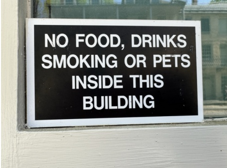

<table border=1 style='margin: auto; word-wrap: break-word;'><tr><td style='text-align: center; word-wrap: break-word;'>You are a professional {source_lang} ({src_lang_code}) to {target_lang}</td></tr><tr><td style='text-align: center; word-wrap: break-word;'>({tgt_lang_code}) translator. Your goal is to accurately convey the meaning and nuances of the original {source_lang} text while adhering to {target_lang} grammar, vocabulary, and cultural sensitivities. Produce only the {target_lang} translation, without any additional explanations or commentary. Please translate the following {source_lang} text into {target_lang}: \n\n\n\n\n\n</td></tr></table>

Figure 3 | Preferred prompt when using the model. source_lang refers to the source language name, e.g. English, src_lang_code to the source language code, e.g. en-US, target_lang to the target language, e.g. German, and tgt_lang_code to the target language code, i.e. de-DE.

Figure 4 | Example of the pictures included in the Vistra benchmark.

the errors with a weighting scheme. We collected the annotations using the open-source Anthea tool. $ ^{3} $ We evaluate the models in 10 language pairs, from 3 distinct source languages:

• English to German

• English to Chinese (Simplified)

• English to Italian

• English to Serbian (Cyrillic)

• English to Korean

• English to Swahili (Kenyan)

• English to Marathi

• Czech to Ukrainian

• Czech to German

• Japanese to English

We selected this set to have a mix of high- and low-resource languages, in addition to having different language families and writing systems. The source data is all taken from the WMT25 translation task, using the literary, news, and social domains. For all language pairs, we evaluated TranslateGemma 12B and 27B, as well as Gemma 3 27B.

To avoid issues with rater fatigue, each document in the dataset was truncated at paragraph boundaries to have no more than 12 source sentences, skipping documents with more than 12 sentences in the first paragraph. However, for the literary domain, where each document is an entire book chapter, documents were split into “chunks” of 1 or more paragraphs up to the 12-sentence limit, with each chunk being human-evaluated in isolation. Following Riley et al. (2024), we used a “pseudo-SxS” rater assignment, where all system outputs for a particular source document were evaluated by the same rater.

The results can be found in Table 3. For most language pairs, the human evaluation confirms the trend we see on the automatic metrics, with TranslateGemma clearly outperforming Gemma 3. There are two exceptions: when the target language is German, where both models are on par, and Japanese→English where TranslateGemma actually suffers a regression. Looking into the error categorization, we found that this is due to mistranslation of named entities, while other error categories did improve.

The improvements for TranslateGemma are especially relevant for low-resource language pairs. E.g. for English to Marathi we obtain an improvement of 1.6 points, or 1.0 for English to Swahili or