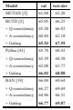
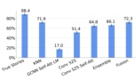
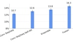

<table border=1 style='margin: auto; word-wrap: break-word;'><tr><td rowspan="2">Model</td><td colspan="4">CS(k)</td><td colspan="2">VQA Accuracy</td></tr><tr><td style='text-align: center; word-wrap: break-word;'>k=1</td><td style='text-align: center; word-wrap: break-word;'>k=2</td><td style='text-align: center; word-wrap: break-word;'>k=3</td><td style='text-align: center; word-wrap: break-word;'>k=4</td><td style='text-align: center; word-wrap: break-word;'>ORE</td><td style='text-align: center; word-wrap: break-word;'>REP</td></tr><tr><td style='text-align: center; word-wrap: break-word;'>MUTAN  $ [5] $</td><td style='text-align: center; word-wrap: break-word;'>56.68</td><td style='text-align: center; word-wrap: break-word;'>43.63</td><td style='text-align: center; word-wrap: break-word;'>38.94</td><td style='text-align: center; word-wrap: break-word;'>32.76</td><td style='text-align: center; word-wrap: break-word;'>59.08</td><td style='text-align: center; word-wrap: break-word;'>46.87</td></tr><tr><td style='text-align: center; word-wrap: break-word;'>BUTD  $ [3] $</td><td style='text-align: center; word-wrap: break-word;'>60.55</td><td style='text-align: center; word-wrap: break-word;'>46.96</td><td style='text-align: center; word-wrap: break-word;'>40.54</td><td style='text-align: center; word-wrap: break-word;'>34.47</td><td style='text-align: center; word-wrap: break-word;'>61.51</td><td style='text-align: center; word-wrap: break-word;'>51.22</td></tr><tr><td style='text-align: center; word-wrap: break-word;'>BUTD + CC</td><td style='text-align: center; word-wrap: break-word;'>61.66</td><td style='text-align: center; word-wrap: break-word;'>50.79</td><td style='text-align: center; word-wrap: break-word;'>44.68</td><td style='text-align: center; word-wrap: break-word;'>42.55</td><td style='text-align: center; word-wrap: break-word;'>62.44</td><td style='text-align: center; word-wrap: break-word;'>52.58</td></tr><tr><td style='text-align: center; word-wrap: break-word;'>Pythia  $ [41] $</td><td style='text-align: center; word-wrap: break-word;'>63.43</td><td style='text-align: center; word-wrap: break-word;'>52.03</td><td style='text-align: center; word-wrap: break-word;'>45.94</td><td style='text-align: center; word-wrap: break-word;'>39.49</td><td style='text-align: center; word-wrap: break-word;'>64.08</td><td style='text-align: center; word-wrap: break-word;'>54.20</td></tr><tr><td style='text-align: center; word-wrap: break-word;'>Pythia + CC</td><td style='text-align: center; word-wrap: break-word;'>64.36</td><td style='text-align: center; word-wrap: break-word;'>55.45</td><td style='text-align: center; word-wrap: break-word;'>50.92</td><td style='text-align: center; word-wrap: break-word;'>44.30</td><td style='text-align: center; word-wrap: break-word;'>64.52</td><td style='text-align: center; word-wrap: break-word;'>55.65</td></tr><tr><td style='text-align: center; word-wrap: break-word;'>BAN  $ [19] $</td><td style='text-align: center; word-wrap: break-word;'>64.88</td><td style='text-align: center; word-wrap: break-word;'>53.08</td><td style='text-align: center; word-wrap: break-word;'>47.45</td><td style='text-align: center; word-wrap: break-word;'>39.87</td><td style='text-align: center; word-wrap: break-word;'>64.97</td><td style='text-align: center; word-wrap: break-word;'>55.87</td></tr><tr><td style='text-align: center; word-wrap: break-word;'>BAN + CC</td><td style='text-align: center; word-wrap: break-word;'>65.77</td><td style='text-align: center; word-wrap: break-word;'>56.94</td><td style='text-align: center; word-wrap: break-word;'>51.76</td><td style='text-align: center; word-wrap: break-word;'>48.18</td><td style='text-align: center; word-wrap: break-word;'>65.87</td><td style='text-align: center; word-wrap: break-word;'>56.99</td></tr></table>

Table 1. Consensus performance on VQA-Rephrasings dataset. CStk) as defined in Eq. 2 is consensus score which is non-zero only if at least k rephrasings are answered correctly, zero otherwise; averaged across all group of questions. ORI represent a split of questions from VQA-Rephrasings which are original questions from VQA v2.0 and their corresponding rephrasings are represented by the split REP. Models trained with our cycle-consistent (CC) framework consistently outperform their baseline counterparts at all values of k.

model won the VQA Challenge in 2017 and achieves 66.25% accuracy on VQA v2.0 test-dev.

Pythia [41] extends the BUTD model by incorporating co-attention [27] between question and image regions. Pythia uses features extracted from Detector [8] pretrained on Visual Genome. An ensemble of Pythia models won the 2018 VQA Challenge using extra training data from Visual Genome [21] and using Resnet [11] features. In this study, we use Pythia models which do not use Resnet features.

Bilinear Attention Networks (BAN) [19]  $ {^6} $ combines the idea of bilinear models and co-attention [27] between image regions and words in questions in a residual setting. Similar to [3], it uses Faster-RCNN [33] pretrained on Visual Genome [21] to extract image features. In all our experiments, for a fair comparison, we use BAN models which do not use additional training data from Visual Genome. BAN achieves the current state-of-the-art single-model accuracy of 69.64 % on VQA v2.0 test-dev without using additional training data from Visual Genome.

Implementation Details For all models trained with our cycle-consistent framework, we use the values  $ T_{times}=0.9 $,  $ \lambda_{G}=1.0 $,  $ \lambda_{C}=0.5 $ and  $ A_{kiter}=5500 $. When reporting results on the validation split and VQA-Rephrasing we train on the training split and when reporting results on the test split we train on both training and validation splits of VQA v2.0. Note that we never explicitly train on the collected VQA-Rephrasing dataset and use it purely for evaluation purposes. We use publicly available implementations of each backbone VQA model.

We measure the robustness of each of these models on

http://github.com/gdzkinkun-tqa

<table border=1 style='margin: auto; word-wrap: break-word;'><tr><td style='text-align: center; word-wrap: break-word;'>Model</td><td style='text-align: center; word-wrap: break-word;'>val</td><td style='text-align: center; word-wrap: break-word;'>test-dev</td></tr><tr><td style='text-align: center; word-wrap: break-word;'>MUTAN  $ [5] $</td><td style='text-align: center; word-wrap: break-word;'>61.04</td><td style='text-align: center; word-wrap: break-word;'>63.20</td></tr><tr><td style='text-align: center; word-wrap: break-word;'>BUTD  $ [3] $</td><td style='text-align: center; word-wrap: break-word;'>65.05</td><td style='text-align: center; word-wrap: break-word;'>66.25</td></tr><tr><td style='text-align: center; word-wrap: break-word;'>+ Q-consistency</td><td style='text-align: center; word-wrap: break-word;'>65.38</td><td style='text-align: center; word-wrap: break-word;'>66.83</td></tr><tr><td style='text-align: center; word-wrap: break-word;'>+ A-consistency</td><td style='text-align: center; word-wrap: break-word;'>60.84</td><td style='text-align: center; word-wrap: break-word;'>62.18</td></tr><tr><td style='text-align: center; word-wrap: break-word;'>+ Gating</td><td style='text-align: center; word-wrap: break-word;'>65.53</td><td style='text-align: center; word-wrap: break-word;'>67.55</td></tr><tr><td style='text-align: center; word-wrap: break-word;'>Pythia  $ [41] $</td><td style='text-align: center; word-wrap: break-word;'>65.78</td><td style='text-align: center; word-wrap: break-word;'>68.43</td></tr><tr><td style='text-align: center; word-wrap: break-word;'>+ Q-consistency</td><td style='text-align: center; word-wrap: break-word;'>65.39</td><td style='text-align: center; word-wrap: break-word;'>68.58</td></tr><tr><td style='text-align: center; word-wrap: break-word;'>+ A-consistency</td><td style='text-align: center; word-wrap: break-word;'>62.08</td><td style='text-align: center; word-wrap: break-word;'>63.77</td></tr><tr><td style='text-align: center; word-wrap: break-word;'>+ Gating</td><td style='text-align: center; word-wrap: break-word;'>66.03</td><td style='text-align: center; word-wrap: break-word;'>68.88</td></tr><tr><td style='text-align: center; word-wrap: break-word;'>BAN  $ [19] $</td><td style='text-align: center; word-wrap: break-word;'>66.04</td><td style='text-align: center; word-wrap: break-word;'>69.64</td></tr><tr><td style='text-align: center; word-wrap: break-word;'>+ Q-consistency</td><td style='text-align: center; word-wrap: break-word;'>66.27</td><td style='text-align: center; word-wrap: break-word;'>69.69</td></tr><tr><td style='text-align: center; word-wrap: break-word;'>+ A-consistency</td><td style='text-align: center; word-wrap: break-word;'>64.96</td><td style='text-align: center; word-wrap: break-word;'>66.31</td></tr><tr><td style='text-align: center; word-wrap: break-word;'>+ Gating</td><td style='text-align: center; word-wrap: break-word;'>66.77</td><td style='text-align: center; word-wrap: break-word;'>69.87</td></tr></table>

Table 2. VQA Performance and ablation studies on VQA v2.0 validation and test-dev splits. Each row in blocks represents a component of our cycle-consistent framework added to the previous row. First row in each block represents the baseline VQA model F. Q-consistency implies addition of a VQG module G to generate rephrasing Q from the image I and the predicted answer A' with an associated VQG loss  $ L_{vgg}(Q, Q') $ A-consistency implies passing all the generated questions Q' to the VQA model F and an associated loss  $ L_{vgg}(A, A') $ Gating implies the use of gating mechanism to filter undesirable generated questions in Q' and passing the remaining to VQA model F. Models trained with our cycle-consistent (last row in each block) framework consistently outperform baselines.

our proposed VQA-Rephrasing dataset using the consensus score (Eq. 2). Table 1 shows the consensus scores at different values of  $ k $ for several VQA models. We see that all models suffer significantly when measured for consistency across rephrasing. For e.g., the performance of Pythia (winner of 2018 VQA challenge) is reduced to a consensus score of 39.49% at  $ k = 4 $. Similar trends are observed for MUTAN, BAN and BUTD. The drop increases with increasing  $ k $, the number of rephrasings used to measure consistency. Models like BUTD, BAN and Pythia which use word-level encodings of the question suffer significant drops. It is interesting to note that even MUTAN which uses skip-thought based sentence encoding [20] suffers a drop when checked for consistency across rephrasings. We observe that BAN + CC model trained with our proposed cycle-consistent training framework outperforms its counterpart BAN and all other models at all values of  $ k $.

Fig 4 qualitatively compares the textual and visual attention (over image regions) over 4 rephrasings of a question. The top row shows attention and predictions from a Pythia model, while the bottom row shows attention and predictions from the same Pythia model, but trained using our framework. Our model attends at relevant image regions.

#### model from the VQA Challenge in 2007 and achieves 66.25% accuracy on VQA v2.0 test-data

Pythia(41)1 extends the BUTD model by incorporating co-attention [27] between question and image regions. Pythia uses features extracted from Detection [8] performed on Visual Genome. An reasonable of Pythia models were the 2018 VQIA Challenge using vision training data from Visual Genome [21] and using Resnet[11] features. In this study, two use Pythia models which do not use Resnet features.

## Fourtacte) letters without a five-day-term-to-year-term

**Billionaire Allocation Networks (BAN) [19]**+ combines the idea of holistic models and co-attention [27] between image regions and words in questions in a residual setting. Similar to [3], it uses Factor-BLNN [33] pretrained on VisualGamma [21] to extract image features. In all our experiments, for a fair comparison, we use BAN models which do not use additional training data from VisualGamma. BAN achieves the current state-of-the-art single-model accuracy of 89.64 % on VQA v2.0 text-dev without using additional training data from VisualGamma.

Implementation Details For all models trained with one cycle-consistent framework, we use the values  $ T_{low}=8.9 $,  $ A_{low}=1.0 $,  $ A_{high}=0.5 $, and  $ A_{high}=550 $. When reporting results on the validation split and VQA-Rephasings we train on the training split and when reporting results on the test split we train on both training and validation splits of VQA-v2.0. Note that we never explicitly train on the collected VQA-Rephasings dataset and use it purely for evaluation purposes. We use publicly available implementations of each backbone VQA model.

We measure the robustness of each of these models on our proposal VQA-Rephases dataset using the common score (Eq. 2). Table 1 shows the common scores at different values of k for several VQA models. We use that all models caffle significantly when measured for consistency across rephases. For e.g., the performance of Pythia (jeanser of 2018 VQA-challenge) is reduced to a common score of 39.69% at k = 4. Similar trends are observed for MUTAN, RAN and RUTD. The drop increases with increasing k, the number of rephases used to measure consistency. Models like RUTD, RAN and Pythia which use a trend-level资格的the-question raffle significant drops. It is interesting to note that even MUTAN which uses skip-thought-based sentence encoding [20] suffers a drop when checked for consistency across rephases. We observe that RAN = CC model trained with our proposed cycle-consistent training framework outperforms its counterpart RAN and all other models at all values of k.

Fig 4 qualitatively compares the textual and visual attention (error image regions) over 4 replications of a question. The top row shows attention and predictions from a Python model, while the bottom row shows attention and predictions from the same Python model, but trained using our framework. Our model attends at relevant image regions

<table border=1 style='margin: auto; word-wrap: break-word;'><tr><td rowspan="2">Model</td><td colspan="3">CS(k)</td><td colspan="3">VQA Accuracy</td></tr><tr><td style='text-align: center; word-wrap: break-word;'>k=1</td><td style='text-align: center; word-wrap: break-word;'>k=2</td><td style='text-align: center; word-wrap: break-word;'>k=3</td><td style='text-align: center; word-wrap: break-word;'>k=4</td><td style='text-align: center; word-wrap: break-word;'>ORI</td><td style='text-align: center; word-wrap: break-word;'>RCEP</td></tr><tr><td style='text-align: center; word-wrap: break-word;'>MU/DAN [5]</td><td style='text-align: center; word-wrap: break-word;'>56.68</td><td style='text-align: center; word-wrap: break-word;'>43.63</td><td style='text-align: center; word-wrap: break-word;'>38.94</td><td style='text-align: center; word-wrap: break-word;'>32.76</td><td style='text-align: center; word-wrap: break-word;'>59.08</td><td style='text-align: center; word-wrap: break-word;'>46.87</td></tr><tr><td style='text-align: center; word-wrap: break-word;'>RUTD [3]</td><td style='text-align: center; word-wrap: break-word;'>60.55</td><td style='text-align: center; word-wrap: break-word;'>46.86</td><td style='text-align: center; word-wrap: break-word;'>40.54</td><td style='text-align: center; word-wrap: break-word;'>34.47</td><td style='text-align: center; word-wrap: break-word;'>61.51</td><td style='text-align: center; word-wrap: break-word;'>51.22</td></tr><tr><td style='text-align: center; word-wrap: break-word;'>RUTD + CC</td><td style='text-align: center; word-wrap: break-word;'>61.66</td><td style='text-align: center; word-wrap: break-word;'>50.79</td><td style='text-align: center; word-wrap: break-word;'>41.68</td><td style='text-align: center; word-wrap: break-word;'>42.88</td><td style='text-align: center; word-wrap: break-word;'>62.44</td><td style='text-align: center; word-wrap: break-word;'>52.98</td></tr><tr><td style='text-align: center; word-wrap: break-word;'>Pythia [40]</td><td style='text-align: center; word-wrap: break-word;'>63.43</td><td style='text-align: center; word-wrap: break-word;'>52.83</td><td style='text-align: center; word-wrap: break-word;'>45.94</td><td style='text-align: center; word-wrap: break-word;'>39.49</td><td style='text-align: center; word-wrap: break-word;'>64.08</td><td style='text-align: center; word-wrap: break-word;'>54.20</td></tr><tr><td style='text-align: center; word-wrap: break-word;'>Pythia + CC</td><td style='text-align: center; word-wrap: break-word;'>64.36</td><td style='text-align: center; word-wrap: break-word;'>58.45</td><td style='text-align: center; word-wrap: break-word;'>58.92</td><td style='text-align: center; word-wrap: break-word;'>44.38</td><td style='text-align: center; word-wrap: break-word;'>64.52</td><td style='text-align: center; word-wrap: break-word;'>58.68</td></tr><tr><td style='text-align: center; word-wrap: break-word;'>RAN [19]</td><td style='text-align: center; word-wrap: break-word;'>64.88</td><td style='text-align: center; word-wrap: break-word;'>53.08</td><td style='text-align: center; word-wrap: break-word;'>47.45</td><td style='text-align: center; word-wrap: break-word;'>39.87</td><td style='text-align: center; word-wrap: break-word;'>64.97</td><td style='text-align: center; word-wrap: break-word;'>55.87</td></tr><tr><td style='text-align: center; word-wrap: break-word;'>RAN + CC</td><td style='text-align: center; word-wrap: break-word;'>65.77</td><td style='text-align: center; word-wrap: break-word;'>56.94</td><td style='text-align: center; word-wrap: break-word;'>51.76</td><td style='text-align: center; word-wrap: break-word;'>48.18</td><td style='text-align: center; word-wrap: break-word;'>65.87</td><td style='text-align: center; word-wrap: break-word;'>56.99</td></tr></table>

Table 1: Common performance on VQA-Rephrenings dataset. CSI(k) as defined in Fig. 2 is consistent score which is now zero only if all hours k rephrenings are antirational correctly, zero otherwise, a wronged across all group of questions. OBI represent a split of questions from VQA-Rephrenings which are original questions from VQA v2.0 and their corresponding rephrenings are represented by the split RIP. Models trained with our cycle-consistent (CC) framework consistently outperform those baseline counterparts at all values of k.

Table 2: VQA Performance and ablation studies on VQA v2.8 validation and text-driven splits. Each step in blocks represents a component of one cycle-consistent framework, added to the previous runs. First step in each block represents the baseline VQA model F. (1) consistency implies addition of a VQA module Q to generate replacements Q from the image I and the predicted anchor A's with an associated VQQ loss  $ C_{ref}(Q, Q) $. A consistency implies passing all the generated questions Q to the VQA model P and an associated loss  $ C_{ref}(A, A) $. Gating implies the use of gating mechanisms to filter undecisable generated questions in Q and passing the remaining to VQA model P. Models trained with one cycle-consistent (last step in each block) framework consistently outperform baselines.

<table border=1 style='margin: auto; word-wrap: break-word;'><tr><td style='text-align: center; word-wrap: break-word;'>Model</td><td style='text-align: center; word-wrap: break-word;'># Parameters (mil)</td><td style='text-align: center; word-wrap: break-word;'>Valid Perplexity</td><td style='text-align: center; word-wrap: break-word;'>Test Perplexity</td></tr><tr><td style='text-align: center; word-wrap: break-word;'>GCNN LM</td><td style='text-align: center; word-wrap: break-word;'>123.4</td><td style='text-align: center; word-wrap: break-word;'>54.50</td><td style='text-align: center; word-wrap: break-word;'>54.79</td></tr><tr><td style='text-align: center; word-wrap: break-word;'>GCNN + self-attention LM</td><td style='text-align: center; word-wrap: break-word;'>126.4</td><td style='text-align: center; word-wrap: break-word;'>51.84</td><td style='text-align: center; word-wrap: break-word;'>51.18</td></tr><tr><td style='text-align: center; word-wrap: break-word;'>LSTM seq2seq</td><td style='text-align: center; word-wrap: break-word;'>110.3</td><td style='text-align: center; word-wrap: break-word;'>46.83</td><td style='text-align: center; word-wrap: break-word;'>46.79</td></tr><tr><td style='text-align: center; word-wrap: break-word;'>Conv seq2seq</td><td style='text-align: center; word-wrap: break-word;'>113.0</td><td style='text-align: center; word-wrap: break-word;'>45.27</td><td style='text-align: center; word-wrap: break-word;'>45.54</td></tr><tr><td style='text-align: center; word-wrap: break-word;'>Conv seq2seq + self-attention</td><td style='text-align: center; word-wrap: break-word;'>134.7</td><td style='text-align: center; word-wrap: break-word;'>37.37</td><td style='text-align: center; word-wrap: break-word;'>37.94</td></tr><tr><td style='text-align: center; word-wrap: break-word;'>Ensemble: Conv seq2seq + self-attention</td><td style='text-align: center; word-wrap: break-word;'>270.3</td><td style='text-align: center; word-wrap: break-word;'>36.63</td><td style='text-align: center; word-wrap: break-word;'>36.93</td></tr><tr><td style='text-align: center; word-wrap: break-word;'>Fusion: Conv seq2seq + self-attention</td><td style='text-align: center; word-wrap: break-word;'>255.4</td><td style='text-align: center; word-wrap: break-word;'>36.08</td><td style='text-align: center; word-wrap: break-word;'>36.56</td></tr></table>

Table 3: Perplexity on WRITINGPROMPTS. We dramatically improve over standard seq2seq models.

Figure 5: Human accuracy at pairing stories with the prompts used to generate them. People find that our fusion model significantly improves the link between the prompt and generated stories.

duced by beam search tend to be short and generic. Completely random sampling can introduce very unlikely words, which can damage generation as the model has not seen such mistakes at training time. The restriction of sampling from the 10 most likely candidates reduces the risk of these low-probability samples.

For each model, we tune a temperature parameter for the softmax at generation time. To ease human evaluation, we generate stories of 150 words and do not generate unknown word tokens.

For prompt generation, we use a self-attentive GCNN language model trained with the same prompt-side vocabulary as the sequence-to-sequence story generation models. The language model to generate prompts has a validation perplexity of 63.06. Prompt generation is conducted using the top-k random sampling from the 10 most likely candidates, and the prompt is completed when the language model generates the end of prompt token.

### 5.5 Evaluation

We propose a number of evaluation metrics to quantify the performance of our models. Many commonly used metrics, such as BLEU for ma

Figure 6: Accuracy of prompt ranking. The fusion model most accurately pairs prompt and stories.

Figure 7: Accuracy on the prompt/story pairing task vs. number of generated stories. Our generative fusion model can produce many stories without degraded performance, while the KNN can only produce a limited number relevant stories.

<table border=1 style='margin: auto; word-wrap: break-word;'><tr><td style='text-align: center; word-wrap: break-word;'>Model</td><td style='text-align: center; word-wrap: break-word;'>Human Preference</td></tr><tr><td style='text-align: center; word-wrap: break-word;'>Language model</td><td style='text-align: center; word-wrap: break-word;'>32.68%</td></tr><tr><td style='text-align: center; word-wrap: break-word;'>Hierarchical Model</td><td style='text-align: center; word-wrap: break-word;'>67.32%</td></tr></table>

Table 4: Effect of Hierarchical Generation. Human judges prefer stories that were generated hierarchically by first creating a premise and creating a full story based on it with a seq2seq model.

duced by beam search tend to be short and generic. Completely random sampling can introduce very unlikely words, which can damage generation as the model has not seen such mistakes at training time. The restriction of sampling from the 10 most likely candidates reduces the risk of these low-probability samples.

For each model, we tune a temperature parameter for the softmax at generation time. To ease human evaluation, we generate stories of 150 words and do not generate unknown word tokens.

For prompt generation, we use a self-attentive GCNN language model trained with the same prompt-side vocabulary as the sequence-to-sequence story generation models. The language model to generate prompts has a validation perplexity of 63.06. Prompt generation is conducted using the top-k random sampling from the 10 most likely candidates, and the prompt is completed when the language model generates the end of prompt token.

## Evaluation

We propose a number of evaluation metrics to quantify the performance of our models. Many commonly used metrics, such as BLEU for ma

<table border=1 style='margin: auto; word-wrap: break-word;'><tr><td style='text-align: center; word-wrap: break-word;'>Model</td><td style='text-align: center; word-wrap: break-word;'>Human Preference</td></tr><tr><td style='text-align: center; word-wrap: break-word;'>Language model</td><td style='text-align: center; word-wrap: break-word;'>32.68%</td></tr><tr><td style='text-align: center; word-wrap: break-word;'>Hierarchical Model</td><td style='text-align: center; word-wrap: break-word;'>67.32%</td></tr></table>

Table 4: Effect of Hierarchical Generation. Human judges prefer stories that were generated hierarchically by first creating a premise and creating a full story based on it with a seq2seq model.

Figure 5: Human accuracy at pairing stories with the prompts used to generate them. People find that our fusion model significantly improves the link between the prompt and generated stories.

<table border=1 style='margin: auto; word-wrap: break-word;'><tr><td style='text-align: center; word-wrap: break-word;'>Model</td><td style='text-align: center; word-wrap: break-word;'># Parameters (mil)</td><td style='text-align: center; word-wrap: break-word;'>Valid Perplexity</td><td style='text-align: center; word-wrap: break-word;'>Test Perplexity</td></tr><tr><td style='text-align: center; word-wrap: break-word;'>GCNN LM</td><td style='text-align: center; word-wrap: break-word;'>123.4</td><td style='text-align: center; word-wrap: break-word;'>54.50</td><td style='text-align: center; word-wrap: break-word;'>54.79</td></tr><tr><td style='text-align: center; word-wrap: break-word;'>GCNN + self-attention LM</td><td style='text-align: center; word-wrap: break-word;'>126.4</td><td style='text-align: center; word-wrap: break-word;'>51.84</td><td style='text-align: center; word-wrap: break-word;'>51.18</td></tr><tr><td style='text-align: center; word-wrap: break-word;'>LSTM seq2seq</td><td style='text-align: center; word-wrap: break-word;'>110.3</td><td style='text-align: center; word-wrap: break-word;'>46.83</td><td style='text-align: center; word-wrap: break-word;'>46.79</td></tr><tr><td style='text-align: center; word-wrap: break-word;'>Conv seq2seq</td><td style='text-align: center; word-wrap: break-word;'>113.0</td><td style='text-align: center; word-wrap: break-word;'>45.27</td><td style='text-align: center; word-wrap: break-word;'>45.54</td></tr><tr><td style='text-align: center; word-wrap: break-word;'>Conv seq2seq + self-attention</td><td style='text-align: center; word-wrap: break-word;'>134.7</td><td style='text-align: center; word-wrap: break-word;'>37.37</td><td style='text-align: center; word-wrap: break-word;'>37.94</td></tr><tr><td style='text-align: center; word-wrap: break-word;'>Ensemble: Conv seq2seq + self-attention</td><td style='text-align: center; word-wrap: break-word;'>270.3</td><td style='text-align: center; word-wrap: break-word;'>36.63</td><td style='text-align: center; word-wrap: break-word;'>36.93</td></tr><tr><td style='text-align: center; word-wrap: break-word;'>Fusion: Conv seq2seq + self-attention</td><td style='text-align: center; word-wrap: break-word;'>255.4</td><td style='text-align: center; word-wrap: break-word;'>36.08</td><td style='text-align: center; word-wrap: break-word;'>36.56</td></tr></table>

Table 3: Perplexity on WritingPrompts. We dramatically improve over standard seq2seq models.

Figure B.4: Pages with tables. Upper: Fan et al. [47] page 6, Lower: Shah et al. [48] page 6

