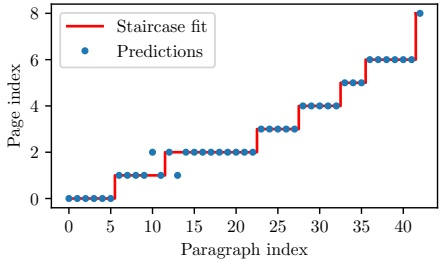

Figure 4: Example for splitting the paragraphs in the source code into different pages. The points in blue denote the page index predicted by the SVM.

we remove these elements in a pre-processing step using pdffigures2 [38]. The recognized captions are are then compared to the captions in the XML file and matched based on their Levenshtein distance [39]. Once the source document has been split into individual pages, the removed figures and tables are reinserted at the end of each page. For a better matching we also replaced unicode characters in the PDF text with corresponding LaTeX commands using the pylatexenc-library $ ^{8} $.

Bag of Words matching First we extract the text lines from the PDF using MuPDF $ ^{9} $ and preprocess them to remove page numbers and potential headers/footers. We then use a Bag of Words model [40] with TF-IDF vectorizer and a linear Support Vector Machine classifier. The model is fitted to the PDF lines with the page number as label. Next we split the LaTeX source into paragraphs and predict the page number for each of them.

Ideally, the predictions will form a stair case function but in practice the signal will be noisy. To find the best boundary points we employ a similar logic as decision trees and minimize a measure based on the Gini impurity

 $$ G_{[a,b]}(i)=(b-a)\cdot\left(1-p_{[a,b]}^{2}(i)-p_{[a,b]}^{2}(i+1)\right), $$ 

where  $ p_{[a,b]}(i) $ is the probability of choosing an element with the predicted page number i in the interval  $ [a, b] $ that describes which paragraphs (elements) were considered for the split.

The best splitting position t in the interval  $ [a, b] $ is then

 $$ \hat{t}_{i}=\arg\min_{t}\left(G_{[a,t]}(i)+G_{[t,b]}(i)\right). $$ 

The search process starts with all paragraphs and for each subsequent page break, the lower bound of the search interval is set to the previous split position. See Fig. 4 for a visualization of an example page.

Fuzzy matching After this first coarse document splitting we try to find the exact position within the paragraph. This is done by comparing the source text within the neighborhood of the predicted splitting position to the last sentences of the previous page of the embedded PDF text, and the first sentences of the next page using the fuzzysearch library $ ^{10} $. If the two dividing points are at the same location in the source text, the page break is considered “accurate” and receives a score of 1. On the other hand, if the splitting positions differ, the one with the smallest normalized Levenshtein distance is selected and given a score of 1 minus the distance. To be included in the dataset, a PDF page must have an average score of at least 0.9 for both page breaks. This results in an acceptance rate of about 47% of all pages.

### 4.2 Ground truth artifacts

Because the dataset was pre-processed by LaTeXML, the markup version of the source code can contain artifacts and commands from unsupported packages. The HTML file may contain subsection titles with numbering even though they are not numbered in the PDF. There may also be instances where figures or tables are missing from the ground truth due to processing errors.